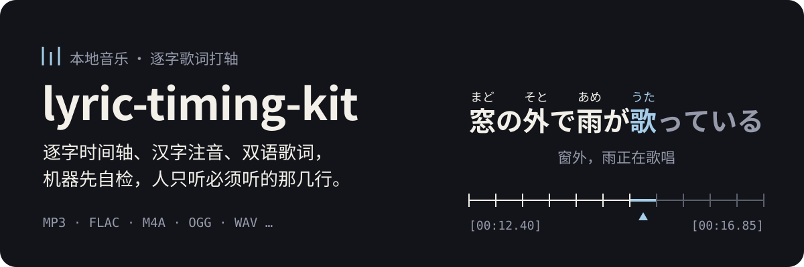

<p align="center">
  
</p>

给本地音乐文件自动打轴：逐字时间轴、双语歌词、汉字注音（Ruby），确认后写回文件的标签。附带一个本地试听页，和一份把整套流程交给 AI Agent 执行的 Skill。

> Word-level lyric timing for local music files (MP3, FLAC, M4A, OGG, WAV and more; Japanese with furigana, Chinese, English, Korean with romanization), a review page built to minimise human checking, and an agent skill that runs the whole workflow. Documentation is in Chinese.

## 人只看必须看的地方

自动打轴本身不难，难的是不知道哪里错了：读音标错、歌词版本和录音不一致、时间整句偏移。所以这套工具的重点是自检和复查，机器能确认的由机器确认，确认不了的缩小成几行交给人。

<p align="center">
  
</p>

- **时间**：新轴和歌词原来自带的时间通常只差一个固定值。试听页算出这个值，只标出不符合规律的行，听一行确认规律、再看这几行就够了。
- **读音**：按“来源 → 上下文 → 录音”三层核对，只有没有来源、录音听起来又对不上的行才会被标出来。
- **确认**：人可以逐行微调时间、写备注、点“通过”。没有通过的内容不会写进音乐文件。

上图是示意，歌词为自造的例句。

## 流程

<p align="center">
  
</p>

1. **打轴**：人声分离，再做强制对齐，得到每个字的时间。
2. **自检**：用听写结果核对歌词版本；读音分三层核对。
3. **复查**：本地试听页只标出可疑的歌和可疑的行。
4. **写入**：把普通双语歌词和带注音的逐字歌词写进音乐文件的标签，写前备份，写后回读校验。

每一步的命令、判断原则和踩过的坑在 [`skill/lyric-timing/references/`](skill/lyric-timing/references/) 里。

## 开始使用

```text
git clone https://github.com/Rizumu85/lyric-timing-kit
cd lyric-timing-kit
cp lyric-kit.config.example.json lyric-kit.config.json    # 填 musicDir
python -m venv .venv                                      # 再按 requirements.txt 的注释装 torch 和依赖
git clone https://github.com/moriwx/FA-Kara vendor/FA-Kara
```

之后有两种用法：

- **交给 Agent**：把 [`skill/lyric-timing`](skill/lyric-timing/) 交给你的 Agent，让它按流程执行，你只需要在试听页上听和点。
- **自己运行**：照 [`pipeline.md`](skill/lyric-timing/references/pipeline.md) 里的命令一步步跑。

试听页：双击 `listen.cmd`（或 `./listen.sh`）。

需要 Node 20+、Python 3.10+、ffmpeg 和一块 8 GB 以上显存的 NVIDIA 显卡。只在 Windows 上完整验证过。

## 支持的格式

解码经 ffmpeg；写入按文件里的标签种类处理，不看扩展名。

| 标签种类 | 格式 |
| --- | --- |
| ID3v2 | MP3、AAC、TTA、WAV、AIFF |
| Vorbis 注释 | FLAC、OGG、Opus |
| MP4 | M4A、ALAC |
| APEv2 | APE、WavPack |
| ASF | WMA |

每种格式把歌词写在哪个标签里，见 [`setup.md`](skill/lyric-timing/references/setup.md)。

## 目录

| 路径 | 内容 |
| --- | --- |
| `tools/` | 全部脚本、试听页和歌名页的模板 |
| `tools/format/` | 歌词格式的读写（ID3、LRC、Ruby LRC），和配套的播放器模组保持一致 |
| `skill/lyric-timing/` | Agent Skill：流程、判断原则、命令和踩过的坑 |
| `folia-mod/lyrics-review/` | 可选的 Folia 播放器插件：听歌时一键把当前歌曲送回试听页。用 `node tools/install_folia_mod.mjs --write` 安装 |
| `data/` | 你的数据（不进仓库）：每首歌的歌词表、草稿、备份、缓存、模型 |

## 播放器

文件里有两份歌词：普通双语 LRC 放在默认的歌词标签里，任何播放器都能读；带注音的逐字歌词使用 TimeTag/NicoKara 的 `@Ruby` 扩展，放在另一个标签里。要显示注音，需要支持该扩展的播放器，例如装了 [双语 · 注音歌词](https://github.com/Rizumu85/folia-bilingual-ruby-lyrics) 模组的 Folia（Folia 的模组市场里可以直接安装）。

## 许可证与使用限制

本仓库的代码以 **GPL-3.0-or-later** 发布，见 `LICENSE`。

**只能用于个人或非商业用途**：流程使用的两个对齐模型分别以 CC BY-NC-SA 4.0 和 CC BY-NC 4.0 发布，禁止商用。模型和第三方代码都不随本仓库分发，由使用者自行获取，清单见 `THIRD-PARTY.md`。

歌词和音乐有版权。本仓库不包含任何歌词，你的 `data/` 目录也不应该公开。
